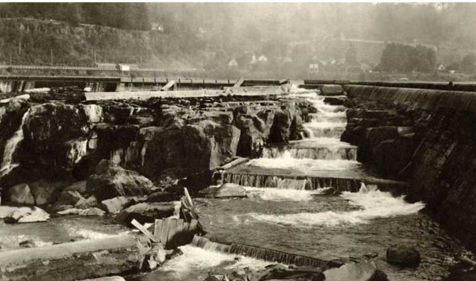

```{r setup, include=TRUE, message=FALSE, warning=FALSE}
knitr::opts_chunk$set(echo = TRUE, message = FALSE, warning = FALSE)

library(bslib)
library(tidyverse)
library(here)
library(lubridate)
library(tsibble)
library(feasts)
library(slider)
```

### Overview  {.tabset .tabset-pills}

This report explores the timing of adult fish passage through the Willamette Falls fish ladder on the Willamette River in Oregon. We focus on three species: coho salmon, jack coho samon, and steelhead trout. Time series data from the *Columbia River Data Access in Real Time* project is used to create visualizations for daily counts, seasonality trends, and annual counts of each species for the years 2001-2010.  

<br>


Willamette Falls Fish Ladder, 1913. Source: OldOregonPhotos.com

<br>


Source: US Army Corps of Engineers, Portland District Website

<br>

Data Source: **Columbia River DART (Data Access in Real Time), 2010.** Courtesy of U.S. Army Corps of Engineers, NWD and Chelan, Douglas, and Grant County PUDs, Yakima Klickitat Fisheries Project, Colville Tribes Fish & Wildlife (OBMEP), Oregon Department of Fish & Wildlife, Washington Department of Fish & Wildlife.

<br>

#### Daily Time Series

```{r}

#read in data

fish_data <- read_csv(here("data", "willamette_fish_passage.csv")) %>% 
  janitor::clean_names()

fish_ts <- fish_data %>% 
  mutate(date = lubridate::mdy(date)) %>% 
  as_tsibble(key = NULL, index = date) %>% 
  pivot_longer(!c(project, date, temp_c), names_to = "species",
               values_to = "count") %>% 
  select(date, species, count) %>% 
  filter(species %in% c("coho", "jack_coho", "steelhead")) %>% 
    mutate(species = case_when(
    species == "coho" ~ "Coho",
    species == "jack_coho" ~ "Jack Coho",
    species == "steelhead" ~ "Steelhead"))

fish_ts[is.na(fish_ts)] <- 0

```

```{r, fig.align='center'}

fish_daily <- fish_ts %>% 
  group_by(species)

ggplot(data = fish_daily,
       aes(x = date, y = count)) + 
  geom_line(aes(color = species)) +
  scale_color_manual(values = c("firebrick", "green", "steelblue")) +
  labs(x = "Date", y = "Passage Count",
       color = "Species") +
  theme_minimal() 
```

**Figure 1. Daily passage counts.** Counts for three species of fish--Coho, Jack Coho, and Steelhead--passing through the Willamette Falls fish ladder are shown daily for the years 2001-2010.

<br>

**Take-Aways:**

- Steelhead counts are generally the highest of the three species.
  - There seems to be a seasonal pattern, as more pass through the ladder at certain times of year, but there does not seem to be an overall trend to the actual number that do so.
- Coho counts usually fall between steelhead and jack coho, excepting a few points, mainly two huge spikes in 2010.
- Jack coho counts are generally the lowest of the three species.

<br>

#### Seasonplots

```{r, fig.align='center'}

fish_month <- fish_ts %>% 
  group_by(species) %>% 
  index_by(yr_mo = ~ yearmonth(.)) %>% 
  summarize(monthly_passage = sum(count, na.rm = TRUE))

fish_month %>% 
  gg_season(y = monthly_passage,
            pal = (viridis::turbo(10))) +
  geom_line(size = 1) +
  theme_minimal() +
  labs(x = "Month", y = "Passage Count")
```

**Figure 2. Monthly Average Passage.** Average counts for three species of fish--Coho, Jack Coho, and Steelhead--passing through the Willamette Falls fish ladder are shown monthly for the years 2001-2010.

<br>

**Take-Aways:**

- Coho and jack coho have similar seasonality, with passage occurring from the end of summer to the beginning of winter (concentrated in fall).
  - Their peaks of activity generally look to be from September to October.
- Steelhead have a much broader stretch of activity, from January to June (midwinter to midsummer).
  - Their peak of activity generally looks to be from May to June.
- 2009 and 2010 were unusually productive years for coho salmon.

<br>

#### Annual Counts by Species

```{r, fig.align='center'}

fish_annual <- fish_ts %>% 
  group_by(species) %>% 
  index_by(yearly = ~year(.)) %>% 
  summarize(annual_passage = sum(count, na.rm = TRUE))

ggplot(data = fish_annual,
       aes(x = yearly, y = annual_passage)) + 
  geom_line(aes(color = species), size = 1) +
  scale_x_continuous(breaks = seq(2001, 2010, 2)) +
  theme_minimal() +
  scale_color_manual(values = c("firebrick", "green", "steelblue")) +
  labs(x = "Year", y = "Annual Passage Count", color = "Species")
```

**Figure 3. Annual Passage Count.** Annual counts for three species of fish--Coho, Jack Coho, and Steelhead--passing through the Willamette Falls fish ladder are shown for the years 2001-2010.

<br>

**Take-Aways:**

- Steelhead counts are generally much higher than either of the other two species, but the actual number of fish passing through is rather unpredictable year-to-year.
- Coho counts are relatively stable until they hit a massive peak in the later years of the dataset.
- Jack coho counts are very low and stay consistent over the life of the data. 

<br>
